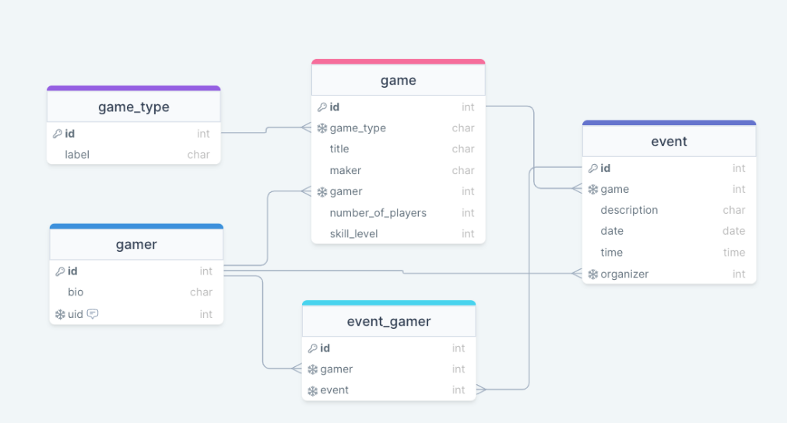

# LEVEL UP: YOUR ULTIMATE GAMING PLATFORM
Level Up is the premier destination for gamers looking to unleash their creativity and connect with like-minded enthusiasts. Our platform empowers you to create new games, organize events, and join a vibrant community of gamers from around the world.

# FEATURES
- Game Creation and Management: Gamers can create games, specifying the game type from a predefined list. They can update or delete their games, reflecting the one-to-many relationship between Gamer and Game.

- Event Creation and Management: Gamers can organize events for games, indicating their role as the organizer. This feature leverages the one-to-many relationship between Gamer (as organizers) and Event.

- Event Participation: Gamers can sign up for events, showcasing the many-to-many relationship between Gamer and Event through the EventGamer join table. This feature would include the ability to join or leave an event.

# PROJECT SETUP INSTRUCTIONS FOR FIRST TIME INSTALLATION
## Starting the Project
1. Create a Firebase project and set up authentication. Use [these videos](https://vimeo.com/showcase/codetracker-firebase) as a refresher if needed.
1. Create a `.env` file at the root of the project
1. Copy/Paste the contents of the `.env.sample` file to your newly created `.env` file.
1. Copy over all of your Firebase values into the `.env` file.
1. Open the `package.json` file and change the `name` property to the name of your application, and `author` to  your name.
1. From your command line, be in the root directory and run `npm install` OR `npm i` for short.
1. Next, run `npm run prepare`. This command sets up husky to track eslint errors on commit that will make your deploy fail on Netlify.
1. To start your application, run `npm run dev`. THIS IS THE COMMAND YOU WILL USE TO RUN YOUR DEVELOPMENT SERVER FROM NOW ON.
1. Open [http://localhost:3000](http://localhost:3000) with your browser.

### If you see this, you are set to go!

You can start editing the page by modifying `pages/index.js`. The page auto-updates as you edit the file.

# TECH / FRAMEWORK USED
-  
- [API Documentation](https://documenter.getpostman.com/view/29856352/2sA3kSo3i8)

### BUILT WITH  
- React
- Django
- SQL
- Firebase

